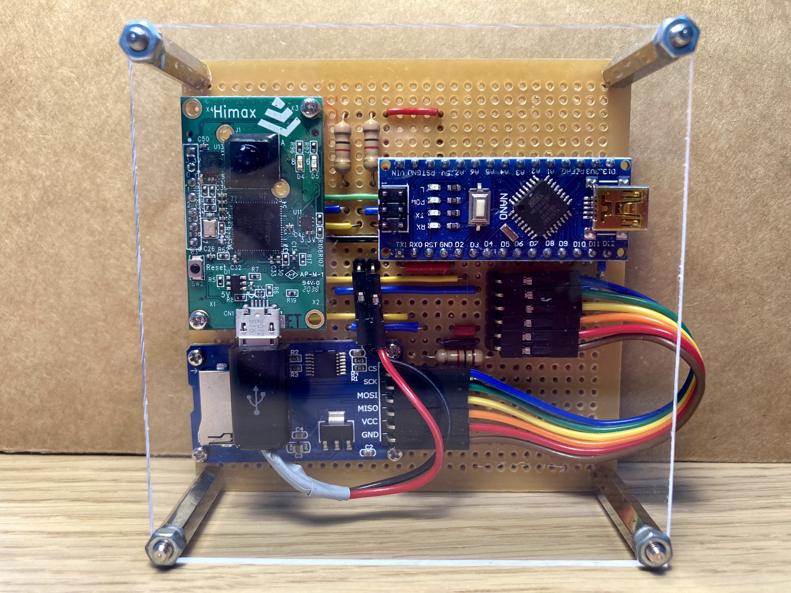
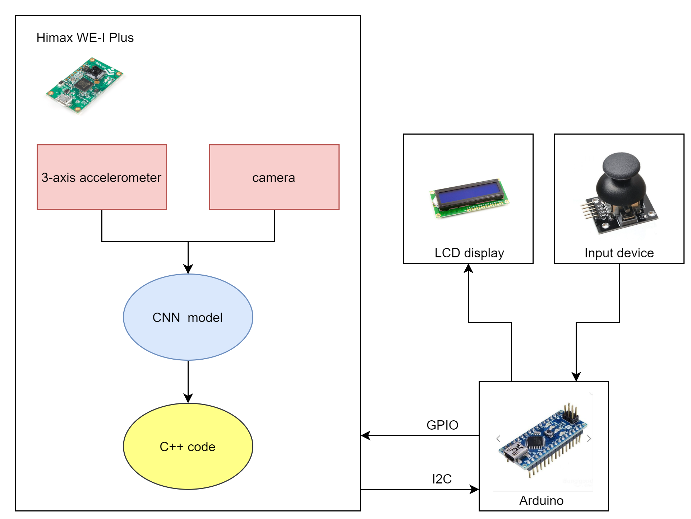
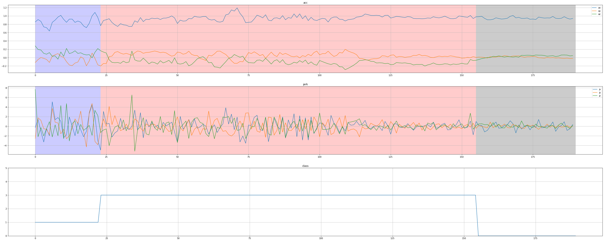
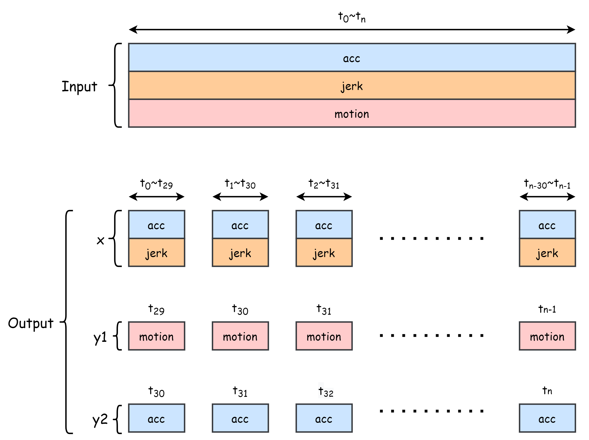
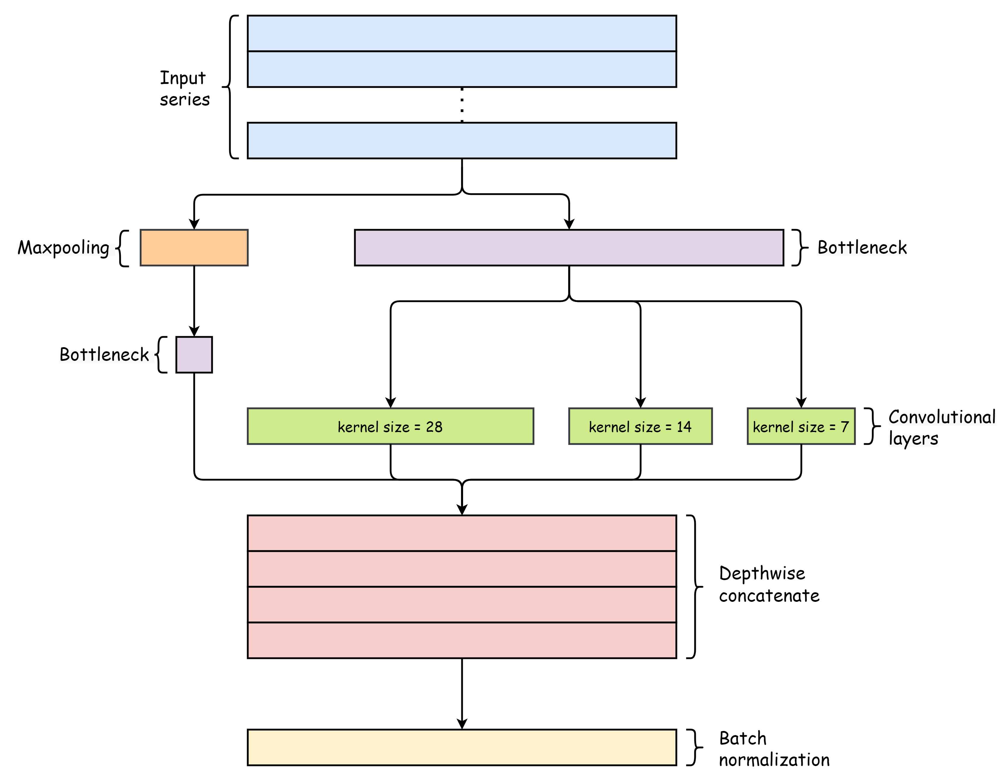
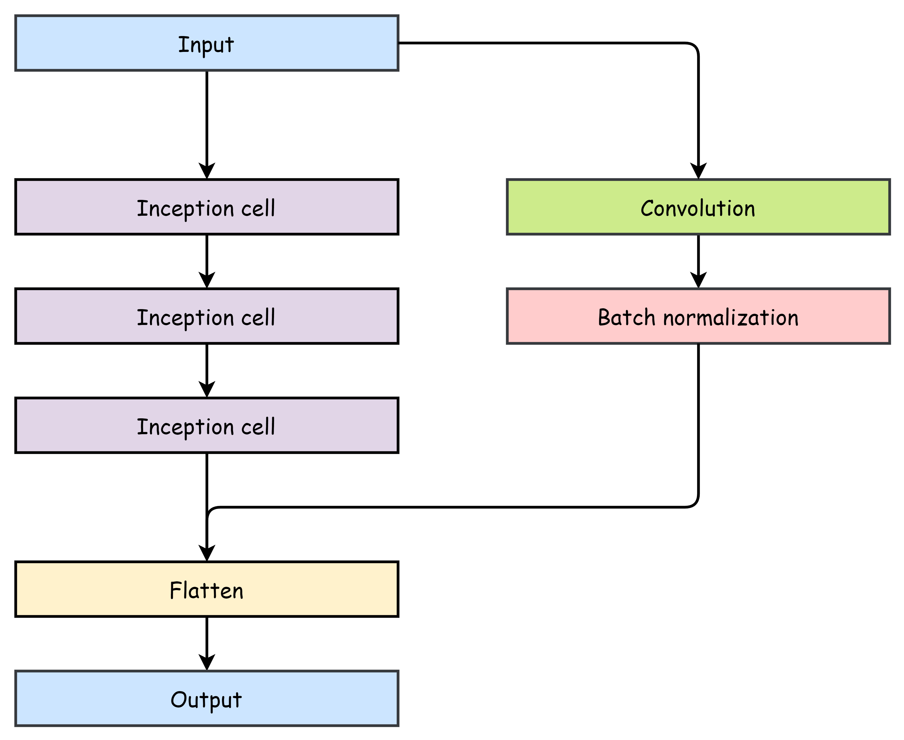
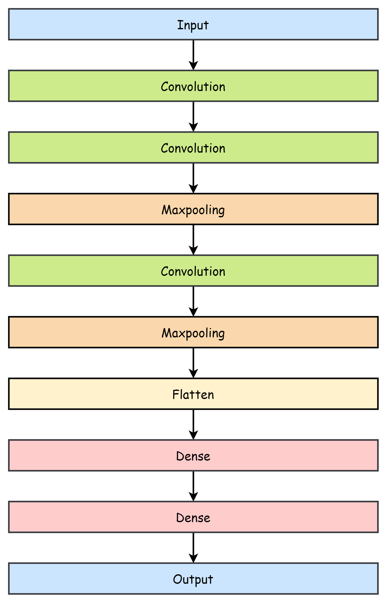
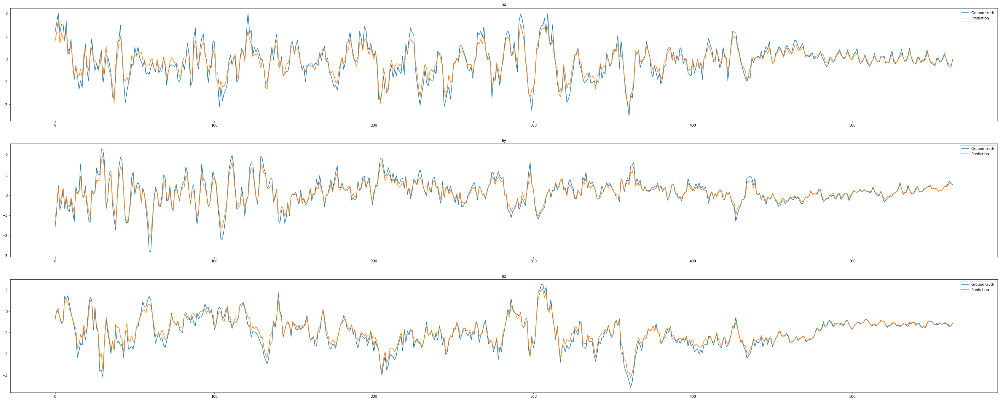
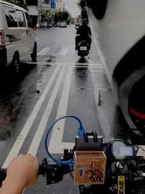

# ARC-AIoT-driver-feedback-system

## Introduction

The project is aiming for constructing a driver feedback system that can detect the behavior of the vehicle and analyze the steering style of the driver.

## Develop Board/Module (till May 30th)

* Himax WE-1 Plus EVB
  * Edge AI development board, for real time inference
  * Labeling
    * Master device on I2C for accelerometer data transmission when labeling
  * Inference time
    * Master device on I2C for detection result transmission during inference time
  * [Source Code](./himax_we1_evb)
* Arduino Nano
  * Simple development board 
  * Labeling
    * Slave device on I2C to receive data from Himax WE-1 Plus EVB and write it to SD card
  * Inference time
    * Slave device on I2C to receive detection result and display it via LEDs
  * [Source Code](./arduino)
* Micro SD Card Module
  * Record data when labeling

## System Overview

## Hardware Architecture

Upcoming design

## Schematic Diagram

TBD.

## Models

[Source code](./train/Colab Notebooks/SafeDriver.ipynb)

### Platform

We use tensorflow functional API to build our models. Tensorflow functional API provides us a more flexibility  way to build models while using self-defined residual network and branch structure.

The tensorflow keras models are converted to tensorflow lite integer 8 models before deploying on Himax WE-1 Plus EVB.

### Input data

#### Features

* 3-axis acceleration
* 3-axis jerk

The acceleration is measured by the 3-axis accelerometer on  Himax WE-1 Plus EVB with 25 Hertz sampling rate, and jerk is the derivative of acceleration.

#### Labels

We have six classes of labels, each label is mapped to a specific driving  behavior.

| Label | State      | Condition of vehicle    |
| :---: | ---------- | ----------------------- |
|   0   | Idle       | Stay still              |
|   1   | Cruise     | Cruise with fixed speed |
|   2   | Accelerate | Speed up                |
|   3   | Brake      | Speed down              |
|   4   | Left       | Turn left               |
|   5   | Right      | Turn right              |

### Work flow of data preprocessing

<h4 id="workflow1">Separate training and valid data</h4>

We separate the training and valid files in the beginning, which means the data from a single file are either in training dataset or valid dataset. In this step, the features in CSV files are read and the labels are converted to one-hot format.

<h4 id="workflow2">Split data by classes</h4>

Separating the data by their labels, observing the size of each class of data and deciding how to balance the data by augmentation.

<h4 id="workflow3">Data augmentation</h4>

Using rotation matrix and multiply with some original data to generate new training data.

<h4 id="workflow4">Normalization</h4>

Calculating the mean values and standard deviations of each features, and normalize the data using the format: 

<h4 id="workflow5">Split sequences for training models</h4>

We choose a value to be the length of our training sequences, and generate the sequences for training and validation. The output *x* is the training sequence, containing the consequent time series signals of length *30*, *y1* is the category of motion in the duration of  *x*, and *y2* is the information after the time of  *x*. Both models has the common input training data *x* , but *y1* is for **classifier** model, and *y2* is for **predictor** model.

| Output | Meaning                                                      |
| ------ | ------------------------------------------------------------ |
| x      | Time series of information from tstart to tstart+n. |
| y1     | The class of motion of tstart to tstart+n. |
| y2     | The information of tstart+n+1.                    |

## Classifier model

### Usage

The classifier is a model which classifies the input sequences into six different categories of motions. The input of classifier model is the acceleration and jerk of the last *n* samples, and the output is one of the above six state.

| Input                                        | Output                      |
| -------------------------------------------- | --------------------------- |
| Latest *n* samples of acceleration and jerk. | Category of current motion. |

### Structure

#### Inception cell

An inception cell contains two primary branches, one is bottleneck branch. A bottleneck layer is used to reduce the dimensionality of the inputs,  following  by three Conv1D layers of different kernel size to specify long-term, mid-term and short-term features. The other one is Maxpooling1D branch and follow by a Conv1D layer with kernel size equals to 1. The four Conv1D layer are concatenate along the depth dimension.

#### Complete model

A complete classifier model is built by three inception cell, including one residual net work from input layer to the second

inception cell, and the flatten and output layers.

## Predictor model

### Usage

The predictor model predict the future values of 3-axis acceleration by observing the last *n* samples.

| Input                                       | Output                                                |
| ------------------------------------------- | ----------------------------------------------------- |
| Latest *n* samples of acceleration and jerk | The predict values of 3-axis acceleration next sample |

### Structure

The predictor model is built by several Conv1D and Maxpooling1D layers in the first half, and fully connected layers in the second half.

### Demonstration

## Deploy Steps

## Demo

|       |       |      |
| :------------------------: | :-----------------------: | :---------------------: |
| 1_cruise (LED displays 01) | 2_start (LED displays 10) | 3_stop (LED display 11) |

