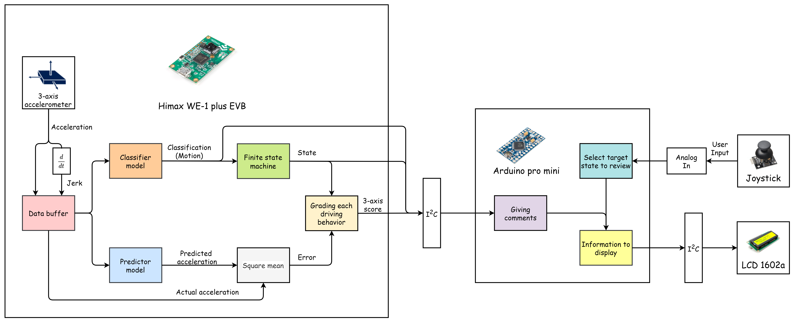
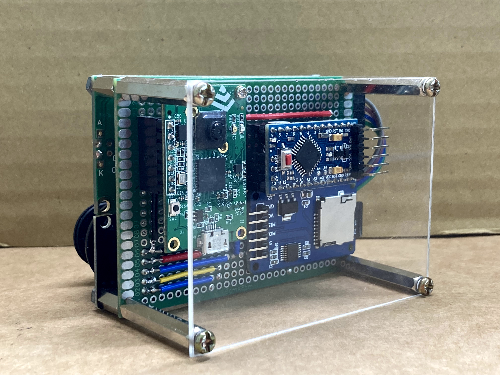
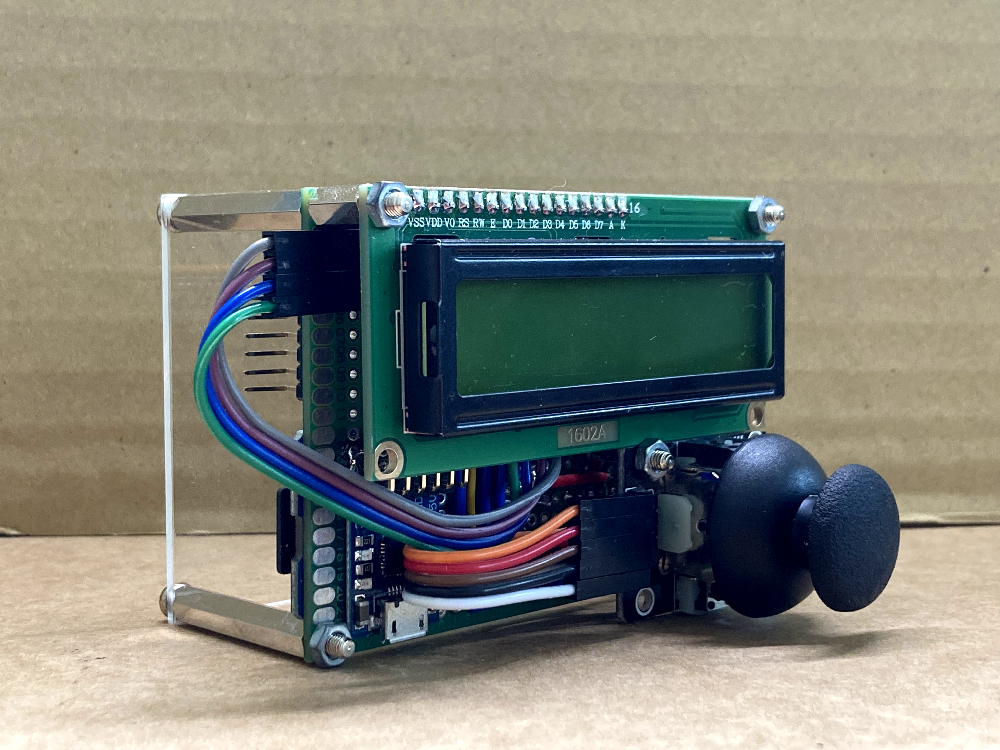
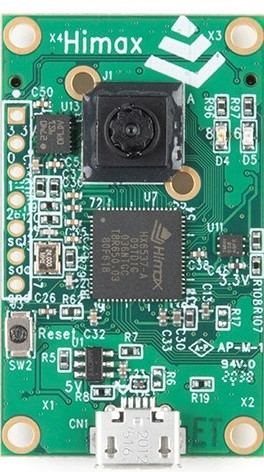
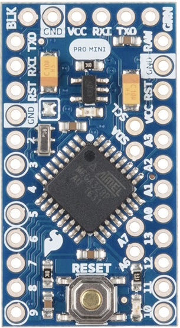
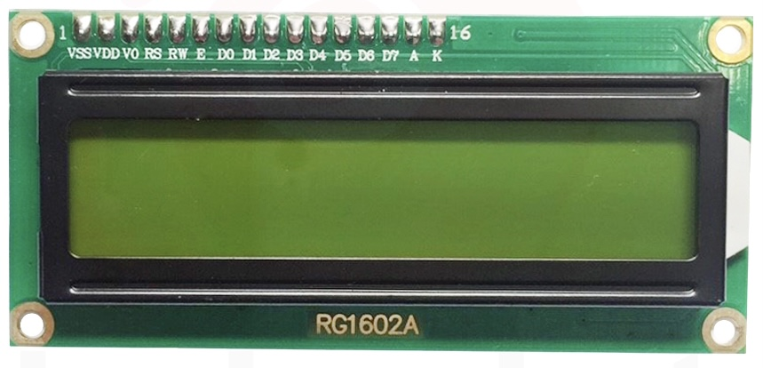
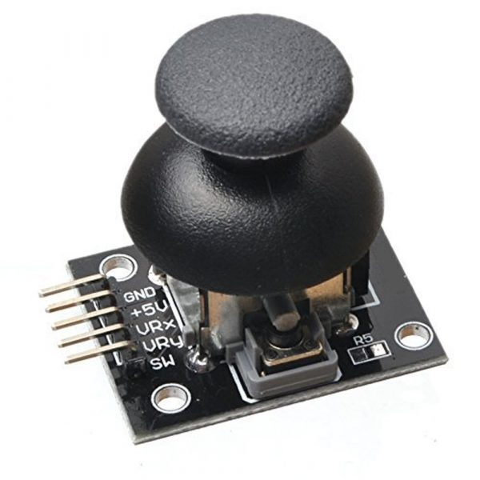
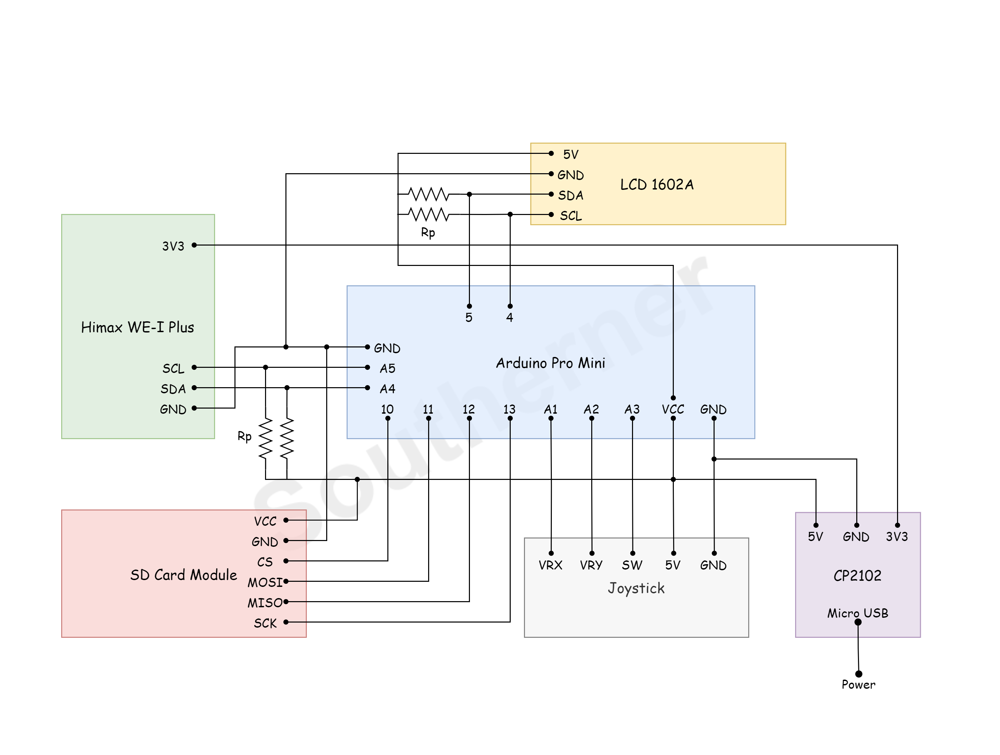

# ARC-AIoT-driver-feedback-system

## Introduction

The project is aiming for constructing a driver feedback system that can detect the behavior of the vehicle and analyze the steering style of the driver. The hardware device is placed on the vehicle and receiving the acceleration data while driving, and the software determines the actual driving behavior and scores. 

Our goal is to provide the users an objected way to analyze their steering styles, and giving some suggestions for approving driving skills, bringing up safer driving habits and  more efficient steering methods.


## Hardware / Software Setup

### System Overview



### Close Up Views

| Front                                              | Rear                                               |
| -------------------------------------------------- | -------------------------------------------------- |
|  |  |

### Development Board and modules



* **Himax WE-I Plus EVB**

  * Endpoint AI development board
  * In collaboration with Google TensorFlow Lite for Microcontrollers framework and Synopsys embARC MLI library
  * Collect acceleration data by the built 3-axis accelerometer
  * 2 TFLite models deployed on board
  * I2C master for data transimission
  
  



* Arduino Pro Mini

  * Microcontroller board based on the ATmega328
  * I2C slave for data transimission
  * Serve as the handler for human-machine interface
  * Use digital pin to simulate I2C master to communicate with LCD display



* **LCD 1602A**

  * 2 line 16 character LCD display module with I2C converter
  * To display information for the user



* **Joystick Module** 

  * Serve as user input
  * To detect Up / Down / Left / Right / Press / Release operations from the user
  
* **SD Card Module**

  * To record the grading history (TBD)

* **CP2102 Micro USB to TTL Module (optional)**

  * Connected with Micro USB to supply power to the system
  * 5V for Arduino
  * 3.3V for Himax WE-I Plus EVB

### Schematic Diagram



Follow the schematic diagram and connect all components in place, then the system are ready to go for software setup.

### Compile Source Codes for Himax WE-I Plus EVB

At the root of the repository, we first change the directory to the [source code](./himax_we1_evb/driver_feedback_system):

```bash
$ cd ./himax_we1_evb/driver_feedback_system
```

Then execute the command to compile the source code and flash a image file:

```bash
$ make
$ make flash
```

### Burn the program to Himax WE-I Plus EVB

Open the serial application of your choice to upload the generated image file to the development board.

Here we take [Minicom](https://linux.die.net/man/1/minicom) as example:

Open Minicom setup (may need super user permission), via: 

```bash
$ minicom -S
```

Inside the setup, set `Bps/Par/Bits` to `115200` , `Hardware Flow Control` and `Software Flow Control` to `No` .

Exit the setup and open the Serial Device of Himax WE-I Plus EVB. If it is the first device you plugged into the USB connector on your computer, then it would be ad /dev/ttyUSB0.

Use the Xmodem protocol to upload the image file:

1. Keep pressing '1' on your keyboard

2. Press the reset button on the development board

3. Then the information you get may be like this

   ```
   -----------------------------------------------------------
    Himax WEI Boot loader
   ------------------------------------------------------------
   
   embARC Build Time: Jan  4 2021, 13:44:14
   Compiler Version: Metaware, 4.2.1 Compatible Clang 8.0.1
   Boot loader Version : 1.4.4 (Date:Jan  4 2021)
   chip version : 0x8535a1
   cpu speed : 400000000 hz
   spi speed : 50000000 hz
   wake up evt:4
   -----------------------------------------------------------
   [0] return to bootup
   [1] Xmodem download and burn FW image
   ------------------------------------------------------------
   
   
   Send data using the xmodem protocol from your terminal
   CCCCCC
   ```

4. Press 'Ctrl-A' (keybinding for Minicom command) then 's' to enter data sending setup.

5. Choose `xmodem`  then specify the image file `output_gnu.img` to upload.

6. Once uploading is done, press any  key on your keyboard and reset the Himax WE-I Plus EVB.

7. Done. The program will be running on it.

### Uploading the Arduino Program

At the root of the repository, we first change the directory to the [source code](./arduino/driver_feedback_system):

```bash
$ cd ./arduino/driver_feedback_system
```

Open the source code `driver_feedback_system.ino` with **Arduino IDE**. Specify the Board you are using. For this project **Arduino Pro or Pro Mini** is selected. Then choose the Proccessor if needed, for example, **Atmega328P (5V, 16MHz)** is specified. Finally, choose the correct Serial port for Arduino.

Click the upload button on the up-left corner and wait for magic to take place.

If you have a problem burning the program to Arduino Pro Mini, google it to find out a solution suitable for your device.

### What are the Programs Doing?

* **Himax WE-I Plus EVB**

  According to the system overview, the work flow of the program would start from collecting acceleration data, calculating the derivation of it, called **jerk**, and storing them in the data buffer. Secondly, it quantizes the data stored in the buffer and sequentially passes them to the model inputs, the classifier model and the predictor model.

  After that we retrieve the output from the classifier model, determine the class of motion of highest possibility and update the state machine with the outcome. Transition is triggered whenever some identical classes of a motion occurs consecutively.

  As for predictor, it outputs the predicted value of acceleration of the next cycle. Therefore, we would store the output and wait for the acceleration data of the next cycle. As soon as we get the two, we calculate the difference between them, called error. Within a state, the program accumulate the error,  compute the mean square error (MSE) and transmit the information to Arduino via i2c.

* **Arduino**

  The Arduino retrieves and resolves the data from i2c and displays all the information on the LCD display. By the way, the display is connected as a i2c slave and Arduino would communicate with it using digital pins to simulate i2c signals for the reason that Arduino has already been a slave device when communicating with Himax  WE-I Plus EVB.

  Besides displaying information on the display, the Arduino would also listen to user inputs and do the corresponding feedback, such as selecting what to display.

  The grading system is integrated in the program of Arduino, using the MSE from Himax WE-I Plus EVB as a basis for computing the scores of each class of motion. The smaller the error is, the higher the score would be.

  Arduino also gives comments on all the classes of motion according to the score you get. For example, if you got a high score, it would compliment you. However, if you got a poor grade, it would consider you as a Sambao.


## User Manual

### Placement

This device can be place on the windshield of automobile or a locomotive mobile phone holder. Before activating the system, make sure the LCD display is perpendicular to the ground.

### Activation

The start-up screen will appear after the device is turned on, and the system will stay on **Pending mode**. Keep the vehicle still until the system enters **Idle state**. Not until the vehicle have been idling for a while will the system begins grading or detecting other motions.

### Driving Mode

After leaving pending mode, the system automatically detects the motion of vehicle and determines what the current state is by detected movement i.e., the motion.  When state changes the system grades the driving behavior of  previous state from 0 to 5 stars. The LCD display shows the current state, detected movement and grade of last state (but only last for 3 seconds) while driving.

The Information of  **Driving mode** on the LCD may be like this format:

```
LCD:
    +-----------------+      +-----------------+      +-----------------+
    |  [Idle]       + |  dt  |  Start-off?   + |  dt  | [Start-off]   + |
    | $Brake: 4.5     | ---> | Grading ...     | ---> | Grading ...     |
    +-----------------+      +-----------------+      +-----------------+

    "[Idle]" or "[Start-off]": The current state that the vehicle is in.
    "Start-off?": The system guesses that you are starting-off but not sure enough
    "+": The detected motion or the movement that is taking place, "+" for acceleration.
    "$Brake": The previous state that has been graded by the system.
    "4.5": Number of stars you got by performing the movement.
```

The state information is display as:

| States                        | Strong state  | Weak State    |
| ----------------------------- | ------------- | ------------- |
| Initial                       | `[Initial]`   | N/A           |
| Pending                       | `[Pending]`   | N/A           |
| Idling                        | `[Idle]`      | ` Idle?`      |
| Starting-off                  | `[Start-off]` | ` Start-off?` |
| Braking (or coming to a halt) | `[Brake]`     | ` Brake?`     |
| Turning left                  | `[Left]`      | ` Left?`      |
| Turning right                 | `[Right]`     | ` Right?`     |
| Speeding up (Acceleration)    | `[Accel]`     | ` Accel?`     |

The detected motion or movement is display as:

| Motion / Movement | Symbol                  |
| ----------------- | ----------------------- |
| Unknown           | `.` (period or dot)     |
| Idle              | `_` (underscore)        |
| Acceleration      | `+` (plus sign)         |
| Brake             | `-` (minus sign)        |
| Left              | `<` (less-than sign)    |
| Right             | `>` (greater-than sign) |

Note that that **Motion** is different from **State** . The evident difference is that states are consistent but motions are not, that is, a state must last for a while while a motion is possible to appear only on one frame. The accumulation of consistent motion triggers the state transition. If a given motion is detected and lasts long enough, then the state will transition to corresponding state. For example, if your vehicle are starting-off from still (i.e., idle), the **Acceleration** motion is very likely to be detected many times. As the accumulation reaches the threshold, the transition from **Idle** state to **Starting-off** state will occur.

### Reviewing Mode

You can press the joystick to enter the reviewing mode and select a class of motion to review the final score by push up or down the joystick. The number of occurrences and score are displayed on the screen, and user can read the comment  after push the joystick to the right, or push to the left to continue to view scores of other classes. If you decide to return to driving mode, just simply press the joystick again.

The Information of **Reviewing mode** on the LCD may be like this format:

```
LCD:
    +-----------------+
    | $Start-off: N/A |
    | Total: 0     D  |
    +-----------------+
    Push up ^ |
            | | Push down
            | v
    +-----------------+   Push right   +-----------------+
    | $Brake: 4.5     | -------------> |<Very good!      |
    | Total: 87   UD> | <------------- | Try to keep it  |
    +-----------------+   Push left    +-----------------+
    Push up ^ |
            | | Push down
            | v
    +-----------------+   Push right   +-----------------+
    | $Left: 0.4      | -------------> |<You may be      |
    | Total: 3    UD> | <------------- | a Sambao        |
    +-----------------+   Push left    +-----------------+
            | |
      ...
      
    "$Start-off" or "$Brake", etc: The class of driving state currently reviewing
    "N/A": The state has not been graded.
    "4.5" or "0.4": The average score you have got for the class of driving state
    "Total: 87": 87 occurrences of the class have been detected and graded
    "D" or "UD>" or "<", etc: The valid operations of joystick
      - "U" for Up
      - "D" for Down
      - ">" for Right
      - "<" for Left
```

## Demo

### Driving Mode

* Grading **Start-off**

  

* Grading **Cruise**

  

* Grading **Brake**

  

### Reviewing Mode

* Reviewing the summary of grading of some classes

  


